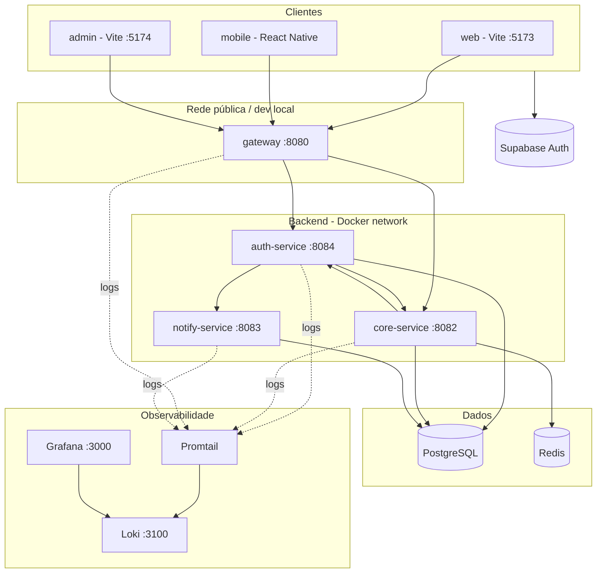
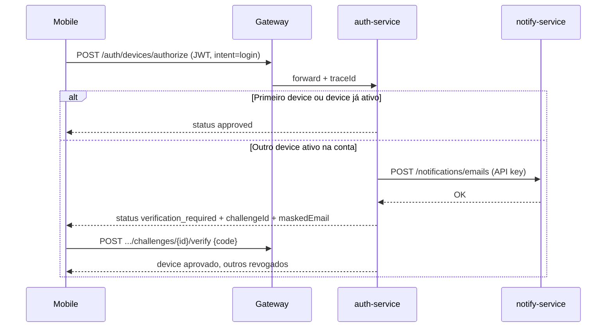
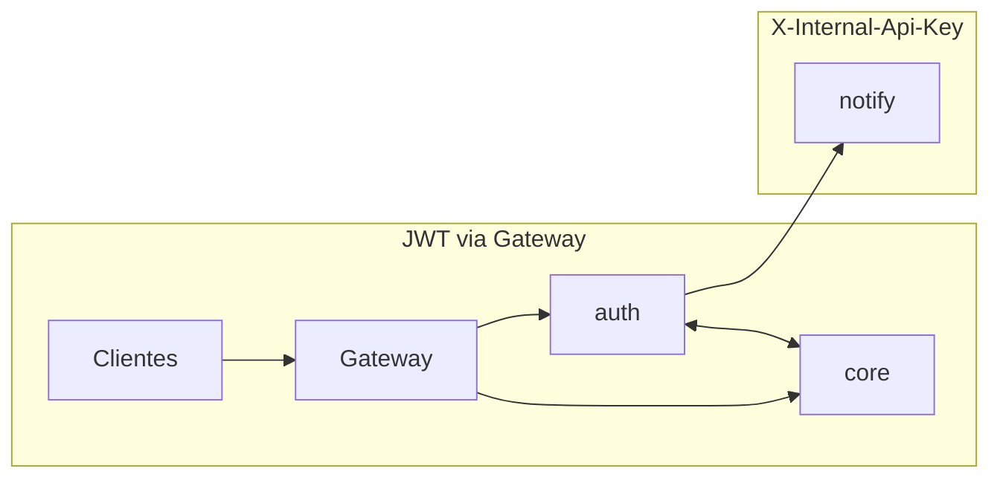

# Arquitetura Whitelabel

Documento vivo da plataforma. Atualize este arquivo quando houver mudanças relevantes em serviços, rotas, segurança ou fluxos.

**Última revisão:** 2026-05-31

---

## Visão geral

Plataforma **multitenant** com autenticação delegada ao **Supabase** (JWT). O backend é composto por microsserviços Java (Spring Boot) atrás de um **API Gateway**. Clientes (web, mobile, admin) falam apenas com o gateway na porta **8080**. O serviço de notificações é **interno** (sem rota pública no gateway).



---

## Repositórios / pastas do monorepo

| Pasta | Responsabilidade |
|-------|------------------|
| `whitelabel-gateway` | Entrada única HTTP, roteamento, CORS, rate limit, correlation ID |
| `whitelabel-auth-service` | Identidade local, dispositivos, web access, admin de identidades |
| `whitelabel-core-service` | Perfil, tenant, feature flags, admin de usuários, auditoria |
| `whitelabel-notify-service` | Entrega de e-mail, push (FCM), SMS |
| `whitelabel-clients` | Monorepo Turborepo: `web`, `mobile`, `admin`, pacotes compartilhados |
| `whitelabel-infra` | Docker Compose, K8s (Kustomize), Terraform |
| `whitelabel-docs` | Arquitetura, env mestre (`.env.master`), scripts de sync |
| `secrets/` | Credenciais locais (ex.: Firebase service account) — não versionar |

---

## Autenticação e autorização

### Modelo

1. O cliente autentica no **Supabase** (`signIn`, `signUp`) e obtém `access_token` (JWT).
2. Chamadas à API passam `Authorization: Bearer <jwt>` e `X-Tenant-ID`.
3. **Gateway** repassa o JWT e injeta/propaga `X-Request-Id` / `X-Trace-Id`.
4. **auth-service** e **core-service** validam o JWT contra as chaves JWKS do Supabase.
5. Rotas **internas** (`/internal/**`) usam `X-Internal-Api-Key` (sem JWT de usuário).
6. **notify-service** aceita apenas chamadas internas com API key.

### Papéis (`UserRole`)

| Papel | Valor JWT / metadata | Uso |
|-------|----------------------|-----|
| `default` | `default` | Usuário final — web e mobile |
| `superadmin` | `superadmin` | Painel admin — gerenciar usuários bloqueados |

- Cadastros novos recebem sempre `default` no app (não confiar no cliente para criar superadmin).
- Superadmin é definido no Supabase (Admin / `app_metadata`).
- Contas **superadmin não autorizam dispositivo no mobile** (bloqueio no `DeviceController`).

### Sincronização de identidade

Após login, os clientes chamam:

1. `POST /auth/sync` — cria/atualiza `identities` no auth-service.
2. `GET /v1/me` — perfil no core-service.

O auth e o core mantêm cópias coerentes do usuário; bloqueio é sincronizado via rotas internas.

---

## API Gateway (`whitelabel-gateway`)

**Porta:** 8080 (Docker e dev padrão)

### Rotas públicas

| Prefixo | Destino | Descrição |
|---------|---------|-----------|
| `/auth/**` | auth-service | Identidade, devices, web-access, admin auth |
| `/v1/**` | core-service | Perfil, tenant, features, admin core |
| `/actuator/health` | gateway | Health do gateway |

**Não exposto:** `/notifications/**` → notify-service (somente rede Docker).

### Filtros globais

| Filtro | Função |
|--------|--------|
| `CorrelationIdFilter` | Gera ou propaga `X-Request-Id` / `X-Trace-Id`; define header na resposta via `beforeCommit` |
| `TenantResolutionFilter` | Garante header `X-Tenant-ID` |
| `JwtRelayFilter` | Repassa `Authorization` ao backend |

### CORS (dev)

Origens permitidas por padrão: `http://localhost:5173`, `5174`, `127.0.0.1` (web e admin).

---

## Auth Service (`whitelabel-auth-service`)

**Porta:** 8084 (Docker Compose) · **Banco:** `whitelabel_auth`

Responsável por tudo que envolve **identidade Supabase espelhada localmente**, **dispositivos** e **acesso web temporário**. Não armazena senha.

### Domínios principais

| Domínio | Tabelas / conceitos |
|---------|---------------------|
| Identity | `identities` — espelho do usuário Supabase |
| Device | `user_devices`, `device_login_challenges` |
| Web access | códigos de acesso web temporários |
| Admin | listagem/bloqueio de identidades `default` |

### Endpoints (via gateway)

| Método | Rota | Auth | Descrição |
|--------|------|------|-----------|
| POST | `/auth/sync` | JWT | Upsert identidade local |
| GET | `/auth/me` | JWT | Identidade local |
| POST | `/auth/devices/authorize` | JWT | Aprova device, exige verificação ou revoga |
| POST | `/auth/devices/challenges/{id}/verify` | JWT | Confirma código e-mail |
| POST | `/auth/devices/challenges/{id}/resend` | JWT | Reenvia código |
| POST | `/auth/devices` | JWT | Registra/atualiza device |
| DELETE | `/auth/devices/{deviceId}` | JWT | Remove device |
| POST | `/auth/web-access/code` | JWT | Gera código acesso web |
| POST | `/auth/web-access/verify` | JWT | Valida código |
| GET | `/auth/web-access/status` | JWT | Status do grant |
| DELETE | `/auth/web-access/grant` | JWT | Revoga grant |
| GET | `/auth/admin/users` | JWT superadmin | Lista usuários default |
| POST | `/auth/admin/users/{id}/block` | JWT superadmin | Bloqueia |
| POST | `/auth/admin/users/{id}/unblock` | JWT superadmin | Desbloqueia |
| PUT | `/auth/admin/users/{id}/blocked` | JWT superadmin | Define estado bloqueado |

### Endpoints internos (API key)

| Método | Rota | Descrição |
|--------|------|-----------|
| PUT | `/internal/users/{supabaseId}/blocked` | Sincroniza bloqueio (chamado pelo core) |

### Fluxo: autorização de dispositivo (mobile)



- `intent=login` — permite novo device com challenge.
- `intent=restore` — sessão em device revogado retorna `device_revoked`.
- E-mail de verificação via **notify** (Mailjet em produção / configurável).

### Integrações

| Destino | Uso |
|---------|-----|
| notify-service | E-mail de challenge, push `device_revoked` |
| core-service | Sincronização de bloqueio (`/internal/users/...`) |

---

## Core Service (`whitelabel-core-service`)

**Porta:** 8082 · **Banco:** `whitelabel_core` · **Cache:** Redis

Coração de **negócio multitenant**: perfil, tenant, feature flags, admin e **auditoria**.

### Domínios

| Domínio | Descrição |
|---------|-----------|
| User | Perfil do usuário (`users`) |
| Tenant | Configuração visual e flags por tenant |
| Feature flags | Funcionalidades habilitadas |
| Audit | `audit_logs` — ações administrativas (`@Auditable`) |

### Endpoints (via gateway)

| Método | Rota | Auth | Descrição |
|--------|------|------|-----------|
| GET | `/health` | Pública | Health |
| GET | `/v1/me` | JWT | Perfil |
| PUT | `/v1/me` | JWT | Atualiza perfil |
| GET | `/v1/tenant/config` | JWT | Tema, logo, config do tenant |
| GET | `/v1/features` | JWT | Feature flags ativas |
| GET | `/v1/admin/users` | JWT superadmin | Lista usuários |
| POST | `/v1/admin/users/{id}/block` | JWT superadmin | Bloqueia |
| POST | `/v1/admin/users/{id}/unblock` | JWT superadmin | Desbloqueia |

### Endpoints internos

| Método | Rota | Descrição |
|--------|------|-----------|
| PUT | `/internal/users/{supabaseId}/blocked` | Sincroniza bloqueio (chamado pelo auth) |

### Auditoria

Ações anotadas com `@Auditable` (ex.: `USER_BLOCK_UPDATED`) geram registro em `audit_logs` via `AuditLogAspect`.

---

## Notify Service (`whitelabel-notify-service`)

**Porta:** 8083 (somente rede interna) · **Banco:** `whitelabel_notify`

Serviço **stateless de entrega** — não contém regra de negócio de produto. Recebe payload pronto e persiste status da entrega.

### Endpoints (rede interna + API key)

| Método | Rota | Descrição |
|--------|------|-----------|
| POST | `/notifications/emails` | `recipient`, `subject`, `body` |
| POST | `/notifications/pushes` | `pushToken`, `data` (FCM data-only) |
| POST | `/notifications/sms` | `recipient`, `body` |
| GET | `/notifications/{id}` | Status da entrega |
| GET | `/actuator/health` | Health (público no serviço) |

### Providers

| Canal | Provider configurável |
|-------|------------------------|
| E-mail | Mailjet (padrão) ou Resend |
| Push | Firebase Cloud Messaging |
| SMS | Twilio (opcional) |

Headers obrigatórios nas chamadas internas:

- `X-Internal-Api-Key`
- `X-Request-Id` / `X-Trace-Id`
- `X-Caller-Service` (ex.: `whitelabel-auth-service`)

---

## Clientes (`whitelabel-clients`)

Monorepo **pnpm + Turborepo**.

| App | Stack | Porta dev | Público |
|-----|-------|-----------|---------|
| `apps/web` | React + Vite | 5173 | Usuário final |
| `apps/admin` | React + Vite | 5174 | Superadmin |
| `apps/mobile` | React Native | — | Usuário final |

### Pacotes compartilhados

| Pacote | Uso |
|--------|-----|
| `@whitelabel/shared-types` | Tipos, roles, `translateAuthError`, validações |
| `@whitelabel/ui` | Componentes UI |
| `@whitelabel/config` | Config compartilhada |

### Comunicação com API

- **Base URL:** `API_GATEWAY_URL` / `VITE_API_GATEWAY_URL` → `http://localhost:8080` (dev).
- **Headers:** `Authorization`, `X-Tenant-ID`, `X-Request-Id` (UUID por requisição).
- **Dev web/admin:** Vite proxy `/auth` e `/v1` → gateway (evita CORS).
- **Mobile físico:** usar IP da máquina, não `localhost`, no `.env`.

### Fluxo de login (mobile / web)

1. Supabase `signInWithPassword`
2. `POST /auth/sync` + `GET /v1/me`
3. Mobile: `POST /auth/devices/authorize` (`intent=login`)
4. Se `verification_required` → tela de código → `verify` / `resend`

### Observabilidade no cliente

- Mobile: logs estruturados `[API]`, `[Auth]`, `[Device]` (`apps/mobile/src/lib/logger.ts`).
- Correlacionar com backend via `X-Request-Id` da resposta.

---

## Comunicação entre serviços



| De | Para | Mecanismo | Exemplo |
|----|------|-----------|---------|
| Cliente | auth / core | JWT + gateway | `/auth/sync`, `/v1/me` |
| auth | notify | RestTemplate + API key | E-mail de device |
| auth | core | RestTemplate + API key | Bloqueio sincronizado |
| core | auth | RestTemplate + API key | Bloqueio sincronizado |

Variável compartilhada: `INTERNAL_SERVICE_API_KEY` (mesmo valor em todos os serviços + Docker Compose).

---

## Bancos de dados (PostgreSQL)

Instâncias lógicas no mesmo Postgres (dev):

| Database | Serviço | Migrações principais |
|----------|---------|----------------------|
| `whitelabel_auth` | auth | identities, web_access, devices, challenges |
| `whitelabel_core` | core | users, tenants, feature_flags, audit_logs |
| `whitelabel_notify` | notify | notifications (entregas) |

Flyway em cada serviço (`src/main/resources/db/migration/`).

**Nota:** Tabelas de device foram **movidas do notify para o auth**; notify mantém apenas `V1__create_notifications.sql`.

---

## Observabilidade

Stack local em `whitelabel-infra/docker`:

| Componente | Porta | Função |
|----------|-------|--------|
| Loki | 3100 | Armazenamento de logs |
| Promtail | — | Coleta logs dos containers Docker |
| Grafana | 3000 | Dashboards (anonymous admin em dev) |

### Trace / request ID

- Cliente envia `X-Request-Id` (UUID).
- Gateway propaga como `X-Request-Id` e `X-Trace-Id`.
- Serviços Java gravam `traceId` / `requestId` no MDC → JSON no profile `observability`.
- Chamadas internas propagam os mesmos headers.

### Dashboard Grafana

- **Whitelabel → Trace flow** (`uid: whitelabel-trace-flow`)
- URL: `http://localhost:3000/d/whitelabel-trace-flow?var-trace_id=<UUID>&from=now-6h&to=now`
- Cole apenas o UUID no campo Trace ID e pressione Enter.

### Log HTTP (auth, core, notify)

Cada requisição gera log `HTTP exchange` com:

- `method`, `path`, `status`, `duration_ms`
- `request=` / `response=` — corpo JSON sanitizado (senhas/tokens redigidos, máx. ~2 KB)

Gateway loga método/path/status (sem body no WebFlux).

---

## Segurança — resumo

| Camada | Mecanismo |
|--------|-----------|
| Autenticação usuário | JWT Supabase (JWKS) |
| Serviço a serviço | `X-Internal-Api-Key` |
| Notify | Sem rota no gateway; só rede interna |
| Logs | Sanitização de campos sensíveis |
| Admin | Role `superadmin` no JWT |
| Mobile | Bloqueio de superadmin em device authorize |

---

## Dev local — portas

| Serviço | Porta host |
|---------|------------|
| API Gateway | 8080 |
| Core | 8082 |
| Auth | 8084 |
| Notify | *(não publicado)* |
| PostgreSQL | 5432 |
| Redis | 6379 |
| Grafana | 3000 |
| Loki | 3100 |
| Web (Vite) | 5173 |
| Admin (Vite) | 5174 |

### Subir o stack

```bash
# Backend + observabilidade
cd whitelabel-infra/docker
docker compose up -d

# Clientes
cd whitelabel-clients
pnpm install
pnpm dev
```

### Variáveis críticas

| Variável | Onde | Descrição |
|----------|------|-----------|
| `INTERNAL_SERVICE_API_KEY` | auth, core, notify, compose | Chave entre serviços |
| `SUPABASE_URL` / `SUPABASE_JWT_SECRET` | auth, core, clients | Auth Supabase |
| `NOTIFY_SERVICE_URL` | auth | `http://notify-service:8083` no Docker |
| `API_GATEWAY_URL` | clients | URL do gateway para apps |
| `TENANT_ID` / `X-Tenant-ID` | clients, APIs | Tenant atual |
| `MAILJET_*` / `EMAIL_*` | notify | Envio de e-mail |
| `FIREBASE_CREDENTIALS_PATH` | notify | Push FCM |
| `SPRING_PROFILES_ACTIVE` | serviços Java | `local,observability` no Docker |

Use `whitelabel-docs/scripts/sync-env-from-master.sh` (a partir de `whitelabel-docs/.env.master`) para alinhar `.env` entre serviços.

---

## Onde expandir (fork / evolução)

| Necessidade | Onde implementar |
|-------------|------------------|
| Nova regra de negócio de produto | `whitelabel-core-service/domain/` |
| Novo tipo de notificação | `whitelabel-notify-service` + chamada no serviço dono do fluxo |
| Nova rota pública | Controller no serviço + rota no gateway se prefixo novo |
| Novo app cliente | `whitelabel-clients/apps/` |
| Feature flag | core `feature_flags` + `GET /v1/features` |
| Auditoria admin | `@Auditable` no core |

---

## Changelog deste documento

| Data | Alteração |
|------|-----------|
| 2026-05-31 | Documento inicial: arquitetura completa, serviços, fluxos, observabilidade, segurança |
| 2026-05-31 | READMEs atualizados e linkados; porta auth 8084; app web README |
| 2026-05-31 | Repositório `whitelabel-docs` com arquitetura, env mestre e scripts |

---

## Referências rápidas

| Documento | Conteúdo |
|-----------|----------|
| [README.md](README.md) | Índice e quick start (este repositório) |
| [ARCHITECTURE.md](ARCHITECTURE.md) | Este arquivo — visão do sistema |
| [whitelabel-infra](https://github.com/educavalcantedev/whitelabel-infra/blob/main/README.md) | Docker Compose, portas, Grafana |
| [whitelabel-clients](https://github.com/educavalcantedev/whitelabel-clients/blob/main/README.md) | Monorepo, apps, headers, debug |
| [whitelabel-gateway](https://github.com/educavalcantedev/whitelabel-gateway/blob/main/README.md) | Rotas e filtros do gateway |
| [whitelabel-auth-service](https://github.com/educavalcantedev/whitelabel-auth-service/blob/main/README.md) | Identidade, devices, admin auth |
| [whitelabel-core-service](https://github.com/educavalcantedev/whitelabel-core-service/blob/main/README.md) | Perfil, tenant, features, auditoria |
| [whitelabel-notify-service](https://github.com/educavalcantedev/whitelabel-notify-service/blob/main/README.md) | E-mail, push, SMS |
| [apps/web](https://github.com/educavalcantedev/whitelabel-clients/blob/main/apps/web/README.md) | App web |
| [apps/admin](https://github.com/educavalcantedev/whitelabel-clients/blob/main/apps/admin/README.md) | Painel superadmin |
| [apps/mobile](https://github.com/educavalcantedev/whitelabel-clients/blob/main/apps/mobile/README.md) | App React Native |
